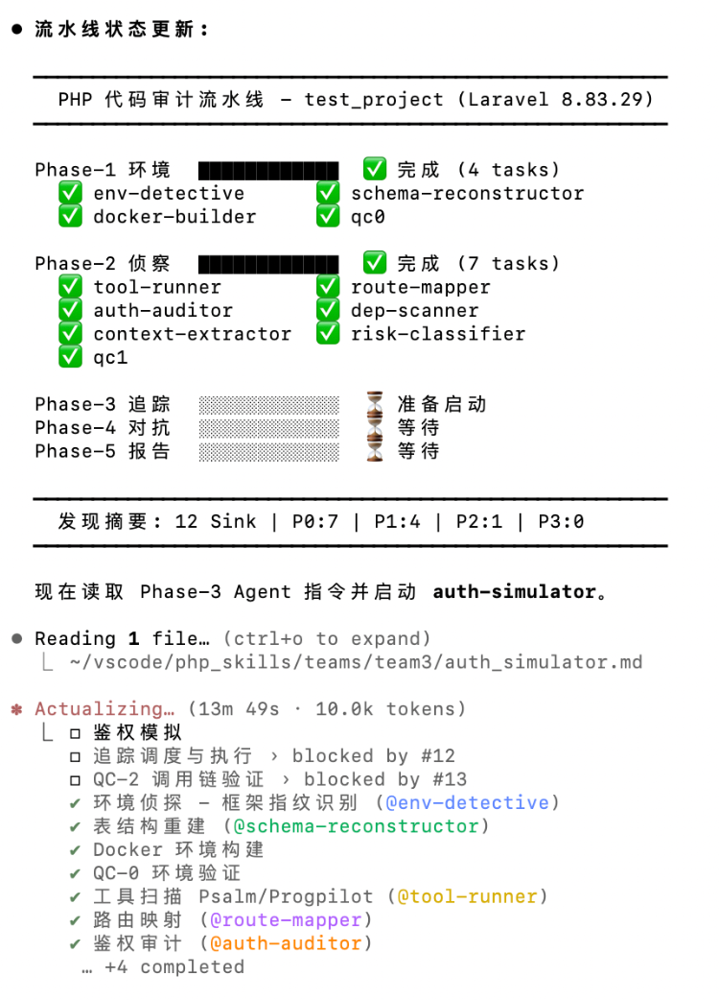

# PHP Audit Skills

专注于 PHP 代码审计的 Claude Skills 集合，提供从环境构建、静态分析、动态追踪到漏洞验证、PoC 与修复建议生成的全链路自动化审计能力。

## 功能特性

- **全链路自动化审计流水线**：按 Phase 1~5 自动编排执行，覆盖侦察、追踪、利用、后渗透、报告收口
- **多漏洞类型覆盖**：RCE、SQLi、反序列化、LFI、文件写入、SSRF、XSS/SSTI、XXE、鉴权、配置、信息泄露、竞态、弱加密、业务逻辑等
- **框架感知调度**：支持 Laravel / ThinkPHP / Symfony / WordPress 等框架特征识别与强制审计项
- **动态专家并行 + 串行攻击**：先并行静态分析，再串行独占容器执行攻击，减少环境冲突
- **质量门禁（Gate）机制**：每个关键阶段均强制校验产物存在性，避免报告缺失 PoC / exploit 证据
- **标准化产物输出**：生成 `audit_report.md`、`audit_report.sarif.json`、`exploits/*.json`、`poc/*.py`、`patches/*.patch` 等

## Team 模式（Agent Teams）

本项目支持 Agent Teams 编排，核心是「主调度器 + 多 Team 分阶段协作」：

- `team1`：环境识别、表结构重建、Docker 构建、QC-0
- `team2`：静态侦察（工具扫描、路由映射、鉴权分析、依赖扫描、上下文抽取、风险定级、QC-1）
- `team3`：鉴权模拟、动态追踪与调用链验证（QC-2）
- `team4`：漏洞专家审计（按 sink 类型动态调度）与物证校验（QC-3）
- `team4.5`：攻击图谱、关联分析、修复建议与 PoC 生成
- `team5`：报告收口、SARIF 导出、环境清理与最终验收（QC-Final）

执行特征：

- **并行 + 串行混合调度**：先并行侦察/分析，再串行独占容器执行攻击
- **动态任务扩展**：根据 `priority_queue.json` 自动创建对应专家审计任务
- **Gate 强制验收**：每阶段结束校验关键产物（如 `context_packs/`、`exploits/*.json`、`poc/*.py`）
- **断点续审与检查点**：通过 `checkpoint.json` 记录阶段状态与统计信息
- **生命周期管理**：支持 agent 优雅关闭（shutdown 请求/响应）与团队清理

## 阶段功能（Phase 1 ~ 5）

| 阶段 | 核心功能 | 关键产物 |
|---|---|---|
| **Phase 1: 环境构建** | 识别框架/版本/依赖，重建数据库 schema，拉起 Docker 审计环境并做 QC-0 | `environment_status.json`、`reconstructed_schema.sql` |
| **Phase 2: 静态侦察** | 工具扫描（Psalm/AST/依赖）、路由映射、鉴权矩阵、Sink 上下文抽取、风险优先级定级 | `route_map.json`、`auth_matrix.json`、`context_packs/`、`priority_queue.json` |
| **Phase 3: 动态追踪** | 鉴权模拟获取凭证，按高风险路由执行 trace，校验调用链与到达性 | `credentials.json`、`traces/*.json`、`trace_dispatch_summary.json` |
| **Phase 4: 深度利用** | 按 sink 类型调度专家审计（RCE/SQLi/SSRF/LFI/XXE 等），输出复现证据并做 QC-3 | `exploits/*.json`、`exploit_summary.json`、`shared_findings.jsonl` |
| **Phase 4.5: 后渗透分析** | 构建攻击图谱、跨审计员关联、生成修复补丁与可执行 PoC | `attack_graph.json`、`correlation_report.json`、`patches/*.patch`、`poc/*.py` |
| **Phase 5: 报告收口** | 输出主报告与 SARIF、执行最终 QC、更新检查点并清理环境 | `audit_report.md`、`audit_report.sarif.json`、`checkpoint.json` |

## 前置要求

在使用之前，建议满足以下条件：

- Docker（必需）
- Docker Compose（必需）
- Claude Code（建议开启 Agent Teams 实验特性）
- tmux（可选，用于分屏查看并行 agent）

> Agent Teams 建议配置：
>
> 在 `~/.claude/settings.json` 的 `env` 中添加：
>
> ```json
> {
>   "env": {
>     "CLAUDE_CODE_EXPERIMENTAL_AGENT_TEAMS": "1"
>   }
> }
> ```

## 目录结构

```text
php-audit-skills/
├── README.md
├── SKILL.md
├── assets/
│   └── php-audit-pipeline.png
├── phases/
│   ├── phase1-env.md
│   ├── phase2-recon.md
│   ├── phase2-tasks-dynamic.md
│   ├── phase3-trace.md
│   ├── phase4-exploit.md
│   ├── phase45-post.md
│   └── phase5-report.md
├── teams/
│   ├── team1/
│   ├── team2/
│   ├── team3/
│   ├── team4/
│   ├── team4.5/
│   └── team5/
├── shared/
├── schemas/
├── tools/
├── templates/
└── references/
```

## 可用 Skills

| Skill | 说明 |
|---|---|
| `PHP_AUDIT_SKILLS` | PHP 全链路自动化安全审计主技能（推荐） |

> 说明：本技能内部会自动调度多个子审计员（env/recon/trace/exploit/post/report），无需手动逐个调用。

## 安装与使用

### 1. 准备环境

确保 Docker 与 Docker Compose 可用：

```bash
docker --version
docker compose version
```

### 2. 配置 Skills

将 `skills` 目录下的内容复制到 Claude Code 的 skills 配置目录中。

> 如果你使用当前仓库结构（无独立 `skills/` 包装目录），可将本仓库整体作为一个 skill 目录放入 Claude Code skills 路径，并命名为 `PHP_AUDIT_SKILLS`。

### 3. 调用 Skill

在 Claude Code 中执行：

```text
/PHP_AUDIT_SKILLS /path/to/project
```

## 演示效果



## 典型输出

- `audit_report.md`：主审计报告
- `audit_report.sarif.json`：SARIF 标准报告
- `exploits/*.json`：漏洞验证与证据记录
- `exploit_summary.json`：漏洞汇总
- `attack_graph.json`：攻击路径图谱
- `correlation_report.json`：跨审计员关联分析
- `patches/*.patch`：修复建议补丁
- `poc/poc_*.py`：可执行 PoC 脚本
- `checkpoint.json`：审计流程进度状态

## 最佳实践

1. 优先使用完整源码目录进行审计，减少误报。
2. 保留 Docker 环境，便于复现实验与证据采集。
3. 报告交付前执行 Gate 与 Schema 校验，确保产物完整。
4. 对 `confirmed` 与 `suspected` 分级管理，先修复高危可利用项。

## 许可证

本项目仅供学习和研究使用。
