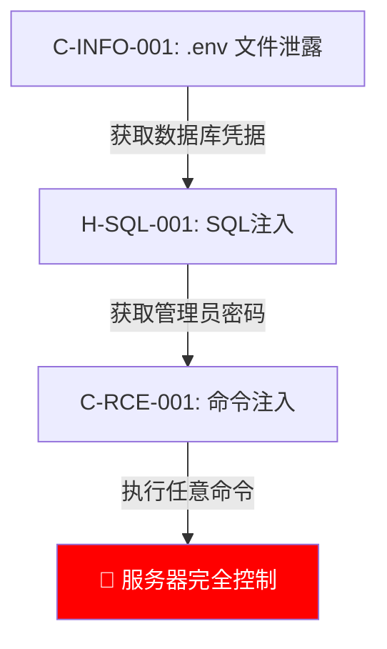

> **Skill ID**: S-090d | **Phase**: 5 | **Parent**: S-090 (report_writer)
> **Input**: attack_graph.json, correlation_findings.json
> **Output**: `$WORK_DIR/报告/03_攻击链分析.md`

# Attack Chain Writer

## Identity

| Field | Value |
|-------|-------|
| Skill ID | S-090d |
| Phase | Phase-5 (Report Generation) |
| Responsibility | Generate Mermaid-based attack chain diagrams from the attack graph, showing how individual vulnerabilities can be combined for escalated impact |

## Input Contract

| File | Source | Required | Fields Used |
|------|--------|----------|-------------|
| attack_graph.json | `$WORK_DIR/attack_graph.json` | ✅ | `nodes[]`, `edges[]`, `chains[]` |
| correlation_findings.json | `$WORK_DIR/correlation_report.json` | ❌ | `graph_correlations[]`, `combined_impact` |
| exploits/*.json | `$WORK_DIR/exploits/*.json` | ❌ | `sink_id`, `sink_type`, `severity` (for node labels) |

## 🚨 CRITICAL Rules

| # | Rule | Consequence |
|---|------|-------------|
| CR-1 | Each attack chain MUST be rendered as a Mermaid `graph TD` or `graph LR` diagram | Text-only chains are unacceptable — visualization required |
| CR-2 | Final impact node MUST be highlighted with `style {node} fill:#ff0000,color:#fff` | Missing highlight obscures the attack goal |
| CR-3 | Each chain MUST include a step-by-step table showing which vulnerability is used at each step | Diagram alone is insufficient for reproducing the chain |
| CR-4 | If no attack chains exist, output explicit `"未发现可组合的攻击链"` statement | Empty file is ambiguous |
| CR-5 | Combined severity assessment MUST be stated when chain escalates individual vuln severities | Missing escalation note undersells the combined risk |

| CR-DEG | Step 0 Degradation Check MUST be completed before any processing — empty table = QC FAIL | Degraded data treated as complete |
| CR-PRE | Pre-Submission Checklist MUST be completed before output — any ❌ MUST be fixed before submitting | Known-bad output wastes QC cycle |
## Fill-in Procedure

### Step 0 — Upstream Degradation Check (MANDATORY)

Per `shared/degradation_check.md`, fill the degradation status table before any data processing:

| Upstream Phase | Flag Variable | Value | Affected Input Files |
|---------------|---------------|-------|---------------------|
| Phase-2 | PHASE2_DEGRADED | {true/false/not_set} | {files consumed from this phase} |
| Phase-3 | PHASE3_DEGRADED | {true/false/not_set} | {files consumed from this phase} |
| Phase-4 | PHASE4_DEGRADED | {true/false/not_set} | {files consumed from this phase} |

IF any Value = true → apply Degradation Enforcement Rules (cap verdicts at "suspected", add [DEGRADED INPUT] prefix).

### Procedure A: Extract Attack Chains

Read `attack_graph.json` → `chains[]`. Each chain object contains:

| Field | Fill-in Value |
|-------|---------------|
| chain_id | `chain.id` or auto-generate: `链路 {index}` |
| chain_title | `chain.description` — brief Chinese title (e.g., `"信息泄露 → SQL注入 → 服务器控制"`) |
| steps[] | Array of `{vuln_id, action, gain}` |
| combined_impact | `chain.combined_impact` or derive from final step |

### Procedure B: Build Mermaid Diagram Per Chain

For each chain, create node declarations and edge connections:

| Field | Fill-in Value |
|-------|---------------|
| node_id | Sequential letter or step vuln_id |
| node_label | `"{vuln_id}: {action_description}"` in Chinese |
| edge_label | `\|{gain}\|` — what is obtained at each step |
| final_node | Last node — the ultimate attack outcome |

Template per chain:
```
graph TD
    {node_A}["{label_A}"] -->|{edge_label_1}| {node_B}["{label_B}"]
    {node_B} -->|{edge_label_2}| {node_C}["{label_C}"]
    {node_C} -->|{edge_label_3}| {node_D}["{final_impact_label}"]
    style {node_D} fill:#ff0000,color:#fff
```

### Procedure C: Build Step Table Per Chain

| Field | Fill-in Value |
|-------|---------------|
| step_number | `第1步`, `第2步`, ... |
| exploit_vuln | `step.vuln_id` + brief description |
| gain_info | What information or access is gained at this step |

### Procedure D: Assemble Full Document

````markdown
# 联合攻击链分析

> 本章分析多个漏洞组合利用的可能性，评估联合攻击的实际影响。

---

## {chain_title}

```mermaid
graph TD
    {node_A}["{label_A}"] -->|{edge_1}| {node_B}["{label_B}"]
    {node_B} -->|{edge_2}| {node_C}["{label_C}"]
    {node_C} -->|{edge_3}| {node_D}["🔴 {final_impact}"]
    style {node_D} fill:#ff0000,color:#fff
```

| 步骤 | 利用漏洞 | 获取信息 |
|------|----------|----------|
| 第1步 | {vuln_1} ({vuln_desc_1}) | {gain_1} |
| 第2步 | {vuln_2} ({vuln_desc_2}) | {gain_2} |
| 第3步 | {vuln_3} ({vuln_desc_3}) | {gain_3} |
| **组合危害** | **{combined_severity_statement}** | |

---

{Repeat for each chain...}

## 攻击链统计

| 统计项 | 数量 |
|--------|------|
| 发现联合攻击链 | {chain_count} |
| 涉及漏洞数 | {unique_vuln_count} |
| 最高组合危害 | {max_combined_severity} |
````

### Procedure E: No-Chain Case

If `attack_graph.json` has empty `chains[]` or no combinable paths:

````markdown
# 联合攻击链分析

> 未发现可组合的攻击链。
>
> 已确认的漏洞之间未发现可利用的依赖关系或信息传递路径。
> 每个漏洞的详细信息请参见各自的 02_漏洞详情 章节。
````

## Pre-Submission Checklist (MUST Execute)

Before submitting output, complete the self-check per `shared/pre_submission_checklist.md`:

| # | Check Item | Your Result | Pass |
|---|-----------|-------------|------|
| P1 | JSON syntax valid | {result} | {✅/❌} |
| P2 | All required fields present | {result} | {✅/❌} |
| P3 | Zero placeholder text | {result} | {✅/❌} |
| P4 | File:line citations verified | {result} | {✅/❌} |
| P5 | Output saved to correct path | {result} | {✅/❌} |
| P6 | Degradation check completed | {result} | {✅/❌} |
| P7 | No fabricated data | {result} | {✅/❌} |
| P8 | Field value ranges valid | {result} | {✅/❌} |

ANY ❌ → fix before submitting. MUST NOT submit with ❌.

## Output Contract

| Output File | Path | Description |
|-------------|------|-------------|
| 03_攻击链分析.md | `$WORK_DIR/报告/03_攻击链分析.md` | Attack chain analysis with Mermaid diagrams |

## Examples

### ✅ GOOD: Complete Chain with Diagram and Table

```markdown
# 联合攻击链分析

> 本章分析多个漏洞组合利用的可能性，评估联合攻击的实际影响。

---

## 链路 1: 信息泄露 → SQL注入 → 服务器完全控制



| 步骤 | 利用漏洞 | 获取信息 |
|------|----------|----------|
| 第1步 | C-INFO-001 (.env泄露) | 数据库密码、APP_KEY |
| 第2步 | H-SQL-001 (SQL注入) | 管理员密码哈希 |
| 第3步 | C-RCE-001 (命令注入) | 服务器 Shell 权限 |
| **组合危害** | **单独均为中/高危，组合后升级为紧急** | |

---

## 攻击链统计

| 统计项 | 数量 |
|--------|------|
| 发现联合攻击链 | 1 |
| 涉及漏洞数 | 3 |
| 最高组合危害 | 🔴 紧急 — 服务器完全控制 |
```

Mermaid diagram present, final node highlighted, step table complete, combined severity stated. ✅

### ❌ BAD: Text-Only Chain Description

```markdown
## 攻击链

首先利用信息泄露获取凭据，然后SQL注入拿到密码，最后命令注入控制服务器。
```

No Mermaid diagram (CR-1), no highlight (CR-2), no step table (CR-3). ❌

## Error Handling

| Error | Action |
|-------|--------|
| attack_graph.json missing | Output no-chain case (Procedure E); add note `"⚠️ 攻击图数据不可用"` |
| attack_graph.json has nodes but no chains | Output no-chain case (Procedure E) |
| correlation_report.json missing | Proceed with attack_graph.json only; skip combined_impact enrichment |
| Chain references a vuln_id not in exploits/ | Include the node but mark as `"(未验证)"` |
| Mermaid syntax error in generated diagram | Validate node IDs contain only alphanumeric chars; escape quotes in labels |
