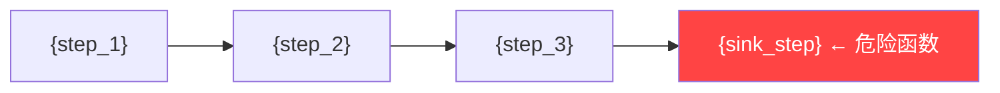

> **Skill ID**: S-090c | **Phase**: 5 | **Parent**: S-090 (report_writer)
> **Input**: exploit_results/*.json, traces/*.json, 修复补丁/*.diff
> **Output**: `$WORK_DIR/报告/02_漏洞详情_{sink_id}.md` (one per confirmed vulnerability)

# Vulnerability Detail Writer

## Identity

| Field | Value |
|-------|-------|
| Skill ID | S-090c |
| Phase | Phase-5 (Report Generation) |
| Responsibility | Generate one detailed vulnerability report per confirmed finding, including description, attack path, PoC, fix, and code comparison |

## Input Contract

| File | Source | Required | Fields Used |
|------|--------|----------|-------------|
| exploit_results/*.json | `$WORK_DIR/exploits/*.json` | ✅ | `sink_id`, `sink_type`, `route`, `severity`, `score`, `final_verdict`, `verification_level`, `evidence`, `iterations`, `sink_location` |
| traces/*.json | `$WORK_DIR/traces/*.json` | ✅ | `source`, `sink`, `chain[]` (data flow steps), `sanitizers` |
| 修复补丁/*.diff | `$WORK_DIR/修复补丁/*.diff` | ❌ | Before/after code snippets for remediation |
| remediation output | `$WORK_DIR/exploits/*.json → remediation` | ❌ | `fix_description`, `fix_code` |

## 🚨 CRITICAL Rules

| # | Rule | Consequence |
|---|------|-------------|
| CR-1 | ONLY generate detail pages for `final_verdict == "confirmed"` entries | Unconfirmed vulns must NOT have detail pages |
| CR-2 | Every detail page MUST include a Burp-format HTTP request that can be directly copied into Burp Repeater | Report fails QC without reproducible PoC |
| CR-3 | Attack chain MUST use Mermaid diagram with danger-node highlighting (`style ... fill:#ff4444`) | Missing visualization fails QC |
| CR-4 | Data flow MUST show complete Source→Sink path with file:line references | Incomplete trace is unverifiable |
| CR-5 | Code comparison MUST show both "修复前" and "修复后" — if no patch available, provide a recommended fix | Missing fix guidance violates report completeness |
| CR-6 | AI verification badge (🟢/🟡/🔴) MUST appear prominently at top of each detail page | Missing badge violates report iron rules |

## Fill-in Procedure

### Procedure A: Iterate Confirmed Vulnerabilities

1. Scan all `$WORK_DIR/exploits/*.json` files
2. For each file where `final_verdict == "confirmed"`, execute Procedures B-G
3. Output one file per vulnerability: `02_漏洞详情_{sink_id}.md`

### Procedure B: Fill Vulnerability Header

| Field | Fill-in Value |
|-------|---------------|
| sink_id | `exploit → sink_id` (e.g., `C-RCE-001`) |
| title | `sink_type` mapped to Chinese + brief description |
| verification_badge | `verification_level` → 🟢/🟡/🔴 badge block (see template) |
| severity_display | `severity` → emoji + Chinese + score (e.g., `🔴 紧急 (9.45分)`) |
| vuln_type_display | `sink_type` mapped to Chinese label |
| affected_route | `route` (HTTP method + path) |
| sink_location | `sink_location` (file:line + function name) |
| auth_requirement | From evidence or route metadata; default `"需进一步确认"` |

### Procedure C: Fill Attack Chain Mermaid Diagram

Read `traces/{sink_id}.json` → `chain[]` array. For each step, create a Mermaid node:

| Field | Fill-in Value |
|-------|---------------|
| node_id | Sequential letter: A, B, C, D, ... |
| node_label | Step description in Chinese (e.g., `"攻击者发送 POST /api/cmd"`) |
| danger_node | The SINK node — apply `style {node} fill:#ff4444,color:#fff` |

Template:
```
graph LR
    A["{step_1_label}"] --> B["{step_2_label}"]
    B --> C["{step_3_label}"]
    C --> D["{sink_label} ← 危险函数"]
    style D fill:#ff4444,color:#fff
```

### Procedure D: Fill Data Flow

From `traces/{sink_id}.json`, extract source-to-sink chain:

| Field | Fill-in Value |
|-------|---------------|
| source | `trace → source` (e.g., `$_POST['cmd']`) |
| chain_steps | Each step in `chain[]` with `function_name [file:line]` |
| sink | `trace → sink` with `function_name [file:line]` + `← SINK` marker |
| sanitizers | `trace → sanitizers` or `"无"` if empty |

### Procedure E: Fill Burp PoC Template

From `exploit → evidence`:

| Field | Fill-in Value |
|-------|---------------|
| http_method | From `evidence.request.method` |
| path | From `evidence.request.path` |
| headers | From `evidence.request.headers` (one per line) |
| body | From `evidence.request.body` |
| response_status | From `evidence.response.status` |
| response_body | From `evidence.response.body` (truncated to 500 chars if needed) |

### Procedure F: Fill Attack Iteration Table

From `exploit → iterations[]`:

| Field | Fill-in Value |
|-------|---------------|
| round | Iteration index: `第1轮`, `第2轮`, ... |
| strategy | `iteration.strategy` description |
| payload | `iteration.payload` |
| result | `iteration.success` → `✅ 成功` or `❌ 失败` + reason |

### Procedure G: Fill Remediation Section

From `修复补丁/{sink_id}.diff` or `exploit → remediation`:

| Field | Fill-in Value |
|-------|---------------|
| fix_before_code | Lines prefixed with `-` from diff, or `exploit → sink_location` original code |
| fix_before_file | Source file path and line |
| fix_after_code | Lines prefixed with `+` from diff, or `exploit → remediation.fix_code` |
| fix_description | `exploit → remediation.fix_description` or generate based on sink_type |

### Assembled Template

For each confirmed vulnerability, output:

````markdown
---

## {sink_id} {title}

### {verification_badge_text}

> 🟢 **AI已实战验证** — AI 向目标发送了真实 HTTP 请求，收到了预期的攻击响应
> 🟡 **AI已分析未实战** — AI 完成了代码分析和数据流追踪，但未发送真实攻击请求
> 🔴 **纯静态发现** — 仅通过代码审查发现，未做动态验证
>
> （保留与 verification_level 匹配的一行，删除其余两行）

| 项目 | 值 |
|------|-----|
| 严重程度 | {severity_display} |
| 漏洞类型 | {vuln_type_display} |
| 影响路由 | {affected_route} |
| Sink 位置 | {sink_location} |
| 鉴权要求 | {auth_requirement} |

### 漏洞描述

{sink_type_chinese_description — 1-2 sentences explaining what this vulnerability is and why it is dangerous}

### 影响分析

{impact_analysis — based on severity scoring: what can an attacker achieve, what data/systems are at risk}

### 攻击链



### 数据流

```
Source: {source}
  → {chain_step_1} [{file}:{line}]
  → {chain_step_2} [{file}:{line}]
  → {sink_function}({param}) [{file}:{line}]  ← SINK
过滤函数: {sanitizers}
```

### Burp 复现模板

> 以下 HTTP 请求可直接复制到 Burp Suite Repeater 中使用

```http
{http_method} {path} HTTP/1.1
Host: {host}
{headers}
Content-Length: {content_length}

{body}
```

**服务器响应:**
```http
HTTP/1.1 {response_status}
{response_headers}

{response_body}
```

### 攻击迭代记录

| 轮次 | 策略 | Payload | 结果 |
|------|------|---------|------|
| {round} | {strategy} | {payload} | {result} |

### 修复方案

**修复前:**
```php
// {fix_before_file}
{fix_before_code}
```

**修复后:**
```php
{fix_after_code}
```

{fix_description}
````

## Output Contract

| Output File | Path | Description |
|-------------|------|-------------|
| 02_漏洞详情_{sink_id}.md | `$WORK_DIR/报告/02_漏洞详情_{sink_id}.md` | One detail page per confirmed vulnerability |

## Examples

### ✅ GOOD: Complete Vulnerability Detail

```markdown
---

## C-RCE-001 命令注入

### 🟢 AI 已发送真实攻击请求并验证成功

> 🟢 **AI已实战验证** — AI 向目标发送了真实 HTTP 请求，收到了预期的攻击响应

| 项目 | 值 |
|------|-----|
| 严重程度 | 🔴 紧急 (9.45分) |
| 漏洞类型 | RCE - 命令注入 |
| 影响路由 | POST /api/cmd |
| Sink 位置 | app/Service/CmdService.php:45 `system()` |
| 鉴权要求 | 无需登录（匿名可访问） |

### 漏洞描述

该接口直接将用户输入拼接到 `system()` 函数中执行，攻击者可注入任意系统命令，获取服务器完全控制权。

### 影响分析

攻击者无需认证即可远程执行任意命令，可读取敏感文件、安装后门、横向渗透内网。影响范围为服务器完全控制，属于最高危漏洞。

### 攻击链


### 数据流

```
Source: $_POST['cmd']
  → CmdController::execute($request) [app/Http/Controllers/CmdController.php:23]
  → CmdService::run($command) [app/Service/CmdService.php:12]
  → system($command) [app/Service/CmdService.php:45]  ← SINK
过滤函数: 无
```

### Burp 复现模板

> 以下 HTTP 请求可直接复制到 Burp Suite Repeater 中使用

```http
POST /api/cmd HTTP/1.1
Host: localhost:8080
Content-Type: application/x-www-form-urlencoded
Cookie: PHPSESSID=xxx
Content-Length: 6

cmd=;id
```

**服务器响应:**
```http
HTTP/1.1 200 OK
Content-Type: text/html

uid=33(www-data) gid=33(www-data) groups=33(www-data)
```

### 攻击迭代记录

| 轮次 | 策略 | Payload | 结果 |
|------|------|---------|------|
| 第1轮 | 基础命令注入 | `;id` | ✅ 成功 |

### 修复方案

**修复前:**
```php
// app/Service/CmdService.php:45
system($command);  // 直接拼接用户输入
```

**修复后:**
```php
$allowed = ['ls', 'whoami', 'date'];
if (in_array($command, $allowed)) {
    system(escapeshellarg($command));
}
```

使用白名单限制可执行命令，并对参数使用 `escapeshellarg()` 转义。
```

All sections complete: description, impact, attack chain with Mermaid, data flow, Burp PoC, iteration table, fix with before/after. ✅

### ❌ BAD: Missing Burp Template and Attack Chain

```markdown
## C-RCE-001 命令注入

| 严重程度 | 🔴 紧急 |
| 漏洞类型 | 命令注入 |

### 修复方案
使用 escapeshellarg。
```

Missing: verification badge (CR-6), Mermaid diagram (CR-3), Burp PoC (CR-2), data flow (CR-4), code comparison (CR-5). ❌

## Error Handling

| Error | Action |
|-------|--------|
| Trace file missing for a confirmed vuln | Generate simplified data flow from exploit evidence; add note `"⚠️ 完整数据流追踪不可用"` |
| No patch file and no remediation in exploit | Generate recommended fix based on sink_type (e.g., parameterized query for SQLi) |
| Evidence missing request/response | Add placeholder: `"⚠️ HTTP 请求/响应数据不可用，请手工验证"` |
| Iterations array empty | Add single row: `"第1轮 | 直接测试 | {from evidence} | ✅ 成功"` |
| sink_id contains special characters | Sanitize for filename: replace `/`, `\`, `:` with `_` |
