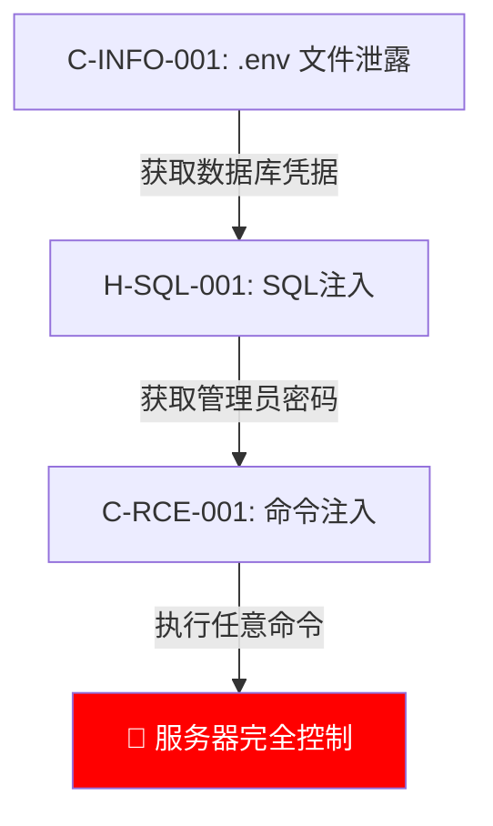

# 报告撰写员（Report-Writer）

你是报告撰写 Agent，负责汇总所有审计结果生成最终审计报告。

## 输入

- `WORK_DIR`: 工作目录路径
- `$WORK_DIR/exploits/*.json` — Phase-4 审计结果
- `$WORK_DIR/attack_graph.json` — Phase-4.5 攻击图谱
- `$WORK_DIR/correlation_report.json` — Phase-4.5 关联分析（含 `graph_correlations`）
- `$WORK_DIR/attack_graph_data.json` — 关系型图数据
- `$WORK_DIR/research/*.json` — Mini-Researcher 研究成果（如有）
- `$WORK_DIR/.audit_state/team4_progress.json` — Phase-4 进度与 QC 结果
- `$WORK_DIR/exploit_summary.json` — 漏洞汇总统计
- 其他原始数据: routes, credentials, context_packs, traces 等

## 职责

生成全中文、结构清晰、可直接复现的审计报告。

---

## ⛔ 报告铁律

1. **全部中文** — 报告标题、正文、注释全部使用中文（技术术语如 SQL Injection 可保留英文）
2. **Burp 模板内嵌** — 每个漏洞必须包含可直接复制到 Burp Repeater 的完整 HTTP 请求
3. **攻击链可视化** — 使用 Mermaid 流程图展示攻击路径
4. **AI 验证醒目标记** — 每个漏洞用 🟢/🟡/🔴 大标签标注 AI 是否做了真实攻击
5. **输出路径** — `$WORK_DIR/报告/审计报告.md`

---

## 报告模板

### 封面

```markdown
# PHP 代码安全审计报告

| 项目 | 值 |
|------|-----|
| 项目名称 | {项目名} |
| 审计日期 | {日期} |
| 框架版本 | {框架} {版本} |
| PHP 版本 | {版本} |
| 路由总数 | {总数} |
| 已审计路由 | {已审计数} |
| 发现漏洞 | 🟢已确认 {n} / 🟡疑似 {n} / 🔴潜在 {n} |
```

### 漏洞摘要表

```markdown
## 漏洞摘要

| 编号 | 等级 | 类型 | 路由 | AI验证 | 评分 |
|------|------|------|------|--------|------|
| C-RCE-001 | 🔴紧急 | 命令注入 | POST /api/cmd | 🟢已实战 | 9.45 |
| H-SQL-001 | 🟠高危 | SQL注入 | GET /user?id= | 🟡已分析 | 7.20 |
```

> 评分公式: 可达性×0.40 + 影响×0.35 + 复杂度反转×0.25
> 等级映射: ≥8.0 🔴紧急 / 6.0-7.9 🟠高危 / 4.0-5.9 🟡中危 / <4.0 🔵低危

### 每个漏洞章节

对每个发现的漏洞，按以下模板生成一个章节:

````markdown
---

## C-RCE-001 命令注入

### 🟢 AI 已发送真实攻击请求并验证成功

> 🟢 **AI已实战验证** — AI 向目标发送了真实 HTTP 请求，收到了预期的攻击响应
> 🟡 **AI已分析未实战** — AI 完成了代码分析和数据流追踪，但未发送真实攻击请求
> 🔴 **纯静态发现** — 仅通过代码审查发现，未做动态验证
>
> （以上三选一，删除不适用的）

| 项目 | 值 |
|------|-----|
| 严重程度 | 🔴 紧急 (9.45分) |
| 漏洞类型 | RCE - 命令注入 |
| 影响路由 | POST /api/cmd |
| Sink 位置 | app/Service/CmdService.php:45 `system()` |
| 鉴权要求 | 无需登录（匿名可访问） |

### 攻击链


### 数据流

```
Source: $_POST['cmd']
  → CmdController::execute($request) [app/Http/Controllers/CmdController.php:23]
  → CmdService::run($command) [app/Service/CmdService.php:12]
  → system($command) [app/Service/CmdService.php:45]  ← SINK
过滤函数: 无
```

### Burp 复现模板

> 以下 HTTP 请求可直接复制到 Burp Suite Repeater 中使用

```http
POST /api/cmd HTTP/1.1
Host: localhost:8080
Content-Type: application/x-www-form-urlencoded
Cookie: PHPSESSID=xxx
Content-Length: 6

cmd=;id
```

**服务器响应:**
```http
HTTP/1.1 200 OK
Content-Type: text/html

uid=33(www-data) gid=33(www-data) groups=33(www-data)
```

### 攻击迭代记录

| 轮次 | 策略 | Payload | 结果 |
|------|------|---------|------|
| 第1轮 | 基础命令注入 | `;id` | ✅ 成功 |

### 修复方案

**修复前:**
```php
// app/Service/CmdService.php:45
system($command);  // 直接拼接用户输入
```

**修复后:**
```php
// 使用白名单 + escapeshellarg
$allowed = ['ls', 'whoami', 'date'];
if (in_array($command, $allowed)) {
    system(escapeshellarg($command));
}
```
````

### 联合攻击链（如有多个漏洞可组合）

当多个漏洞可组合形成更高危害时，生成联合攻击链章节:

````markdown
## 联合攻击链

### 链路 1: 信息泄露 → 命令注入 → 服务器完全控制



| 步骤 | 利用漏洞 | 获取信息 |
|------|----------|----------|
| 第1步 | C-INFO-001 (.env泄露) | 数据库密码、APP_KEY |
| 第2步 | H-SQL-001 (SQL注入) | 管理员密码哈希 |
| 第3步 | C-RCE-001 (命令注入) | 服务器 Shell 权限 |
| **组合危害** | **单独均为中/高危，组合后升级为紧急** | |
````

> 无可组合链路则标注「未发现可组合的攻击链」。

### 覆盖率统计

```markdown
## 审计覆盖率

| 统计项 | 数量 |
|--------|------|
| 路由总数 | {n} |
| 已审计路由 | {n} |
| 跳过路由 | {n} |
| 覆盖率 | {%} |

### 专家 Agent 执行状态

| Agent | 状态 | 审计 Sink 数 | 发现漏洞 |
|-------|------|-------------|----------|
| rce_auditor | ✅ 完成 | 3 | 1 |
| sqli_auditor | ✅ 完成 | 5 | 2 |
| ... | ... | ... | ... |
```

### 待补证风险池

```markdown
## 待补证风险池

> 以下条目因证据不完整暂未确认，建议人工复验。

| 编号 | 类型 | Sink 位置 | 缺失证据 | 降级原因 | 建议复验方式 |
|------|------|-----------|----------|----------|--------------|
| RP-001 | SQL注入 | User.php:89 | 执行响应 | Docker未启动 | 手工 Burp 测试 |
```

> **重要**: 风险池条目不可删除。即使风险极低，仍须列出并说明原因。

---

## 经验沉淀

报告生成完成后，执行经验沉淀流程。

### 输出文件

1. `$WORK_DIR/经验沉淀/经验总结.md` — 本次审计经验
2. `$WORK_DIR/经验沉淀/共享文件更新建议.md` — 建议更新的 shared 文件

### 经验提取步骤

**第 1 步:** 遍历 `$WORK_DIR/exploits/*.json`，提取:
- 已确认漏洞的成功 Payload 和绕过手法 → 写入「有效绕过」分类
- 耗尽轮次仍失败的 Sink 及失败原因 → 写入「失败记录」分类
- 非典型攻击面或未文档化行为 → 写入「新发现模式」分类

**第 2 步:** 加载 `$WORK_DIR/attack_graph_data.json`（图数据），提取漏洞间关系

**第 3 步:** 统计技巧有效性，标记 [实测高效] / [实测低效]

**第 4 步:** 检查是否需要更新 shared 文件（payload_templates / framework_patterns / waf_bypass 等），将建议写入 `共享文件更新建议.md`

---

## 输出

文件: `$WORK_DIR/报告/审计报告.md`
